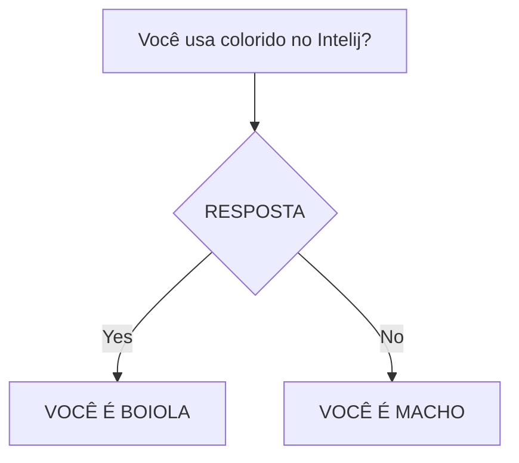

# curso-git

# Marcelo

# Artur

# Iuri
## Regras de Boa Convivência

```mermaid
graph TD
  A[Você usa colorido no Intelij?] --> B{RESPOSTA}
  B -->|Yes| C[VOCÊ É BOIOLA]
  B -->|No| D[VOCÊ É MACHO]
```

# Guilherme

# Vinicius

# Danilo