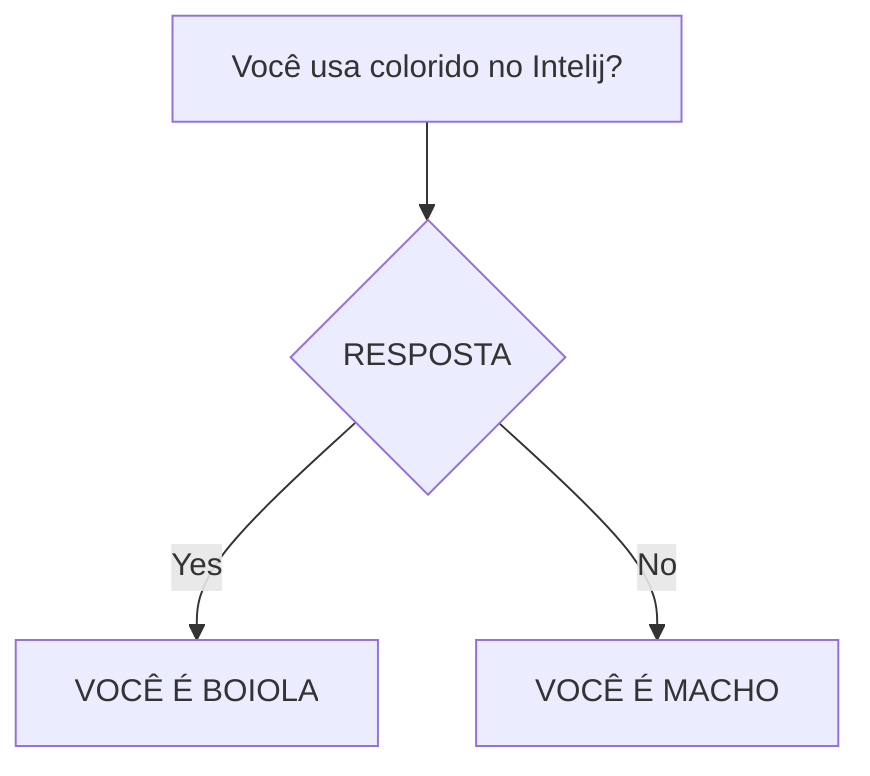

# curso-git

# Marcelo

# Artur
Estudante de engenharia. 

# Iuri
## Regras de Boa Convivência

# Guilherme

# Vinicius
ASA DE MORCEGO, PENA DE GALINHA. SE VOCÊ GOSTA DO VS CODE, DÁ UMA RISADINHA.

# Danilo